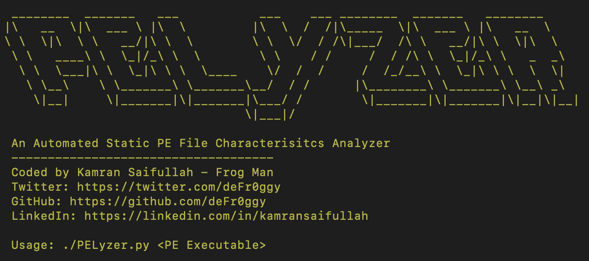

<h4 align="center"> PELyzer - An Automated Static PE File Characteristics Analyzer</h4>

PLyzer is a simple and effecient tool to fetch the details required during the initial phase (Basic Static Analysis) of Malware Analysis.

There are times when you have an exetable on your linux machines and sometimes within the WSL. So, there should be an easy way out to find out the initial information of the executable. On the basis on which further investigations can be done.

PLyzer is able to provide you with the following information. 

- File Type
- DOS Header
- PE Pointer Header
- No of Sections
- Characteristics
- File Creation Date
- Signature: PE Executable
- File Architecture
- PE Sections
- Imported Modules

### In Rage (Packed Executables)

``` ________  _______   ___           ___    ___ ________  _______   ________     
|\   __  \|\  ___ \ |\  \         |\  \  /  /|\_____  \|\  ___ \ |\   __  \    
\ \  \|\  \ \   __/|\ \  \        \ \  \/  / /\|___/  /\ \   __/|\ \  \|\  \   
 \ \   ____\ \  \_|/_\ \  \        \ \    / /     /  / /\ \  \_|/_\ \   _  _\  
  \ \  \___|\ \  \_|\ \ \  \____    \/  /  /     /  /_/__\ \  \_|\ \ \  \  \| 
   \ \__\    \ \_______\ \_______\__/  / /      |\________\ \_______\ \__\ _\ 
    \|__|     \|_______|\|_______|\___/ /        \|_______|\|_______|\|__|\|__|
                                 \|___|/                                       
                                                                                                                 
 An Automated Static PE File Characterisitcs Analyzer
 ------------------------------------
 Coded by Kamran Saifullah - Frog Man
 Twitter: https://twitter.com/deFr0ggy 
 GitHub: https://github.com/deFr0ggy 
 LinkedIn: https://linkedin.com/in/kamransaifullah 

 Usage: ./PELyzer.py <PE Executable>
    
    
[+] File Type: PE32 executable (GUI) Intel 80386, for MS Windows, UPX compressed
[+] DOS Header: MZ (0x5a4d)
[+] PE Pointer Header: 0xe8
[+] No of Sections: 0x3
[+] Characteristics: 0x10f
[+] File Creation Date : Mon Jul 13 15:45:45 2009 UTC
[+] Signature: PE Executable - 0x4550
[+] File Architecture: Intel 386 or later processors and compatible processors

[+] PE Sections

UPX0

Vitual Size : 0xc000

VirutalAddress : 0x1000

SizeOfRawData : 0x0

PointerToRawData : 0x400

Characterisitcs : 0xe0000080

UPX1

Vitual Size : 0xb000

VirutalAddress : 0xd000

SizeOfRawData : 0xae00

PointerToRawData : 0x400

Characterisitcs : 0xe0000040

.rsrc

Vitual Size : 0x1000

VirutalAddress : 0x18000

SizeOfRawData : 0xa00

PointerToRawData : 0xb200

Characterisitcs : 0xc0000040

[+] Imported Modules

ADVAPI32.dll
	 4294716 b'FreeSid'
KERNEL32.DLL
	 4294724 b'LoadLibraryA'
	 4294728 b'ExitProcess'
	 4294732 b'GetProcAddress'
	 4294736 b'VirtualProtect'
MSVCRT.dll
	 4294744 b'_iob'
WS2_32.dll
	 4294752 b'WSARecv'
WSOCK32.dll
	 4294760 b'WSAGetLastError'
```

### In Rage (Not Packed Executables)

```
 ________  _______   ___           ___    ___ ________  _______   ________     
|\   __  \|\  ___ \ |\  \         |\  \  /  /|\_____  \|\  ___ \ |\   __  \    
\ \  \|\  \ \   __/|\ \  \        \ \  \/  / /\|___/  /\ \   __/|\ \  \|\  \   
 \ \   ____\ \  \_|/_\ \  \        \ \    / /     /  / /\ \  \_|/_\ \   _  _\  
  \ \  \___|\ \  \_|\ \ \  \____    \/  /  /     /  /_/__\ \  \_|\ \ \  \  \| 
   \ \__\    \ \_______\ \_______\__/  / /      |\________\ \_______\ \__\ _\ 
    \|__|     \|_______|\|_______|\___/ /        \|_______|\|_______|\|__|\|__|
                                 \|___|/                                       
                                                                                                                 
 An Automated Static PE File Characterisitcs Analyzer
 ------------------------------------
 Coded by Kamran Saifullah - Frog Man
 Twitter: https://twitter.com/deFr0ggy 
 GitHub: https://github.com/deFr0ggy 
 LinkedIn: https://linkedin.com/in/kamransaifullah 

 Usage: ./PELyzer.py <PE Executable>
    
    
[+] File Type: PE32 executable (GUI) Intel 80386, for MS Windows
[+] DOS Header: MZ (0x5a4d)
[+] PE Pointer Header: 0xe8
[+] No of Sections: 0x4
[+] Characteristics: 0x10f
[+] File Creation Date : Sun Aug 30 18:41:44 2009 UTC
[+] Signature: PE Executable - 0x4550
[+] File Architecture: Intel 386 or later processors and compatible processors

[+] PE Sections

.text

Vitual Size : 0xa966

VirutalAddress : 0x1000

SizeOfRawData : 0xb000

PointerToRawData : 0x1000

Characterisitcs : 0x60000020

.rdata

Vitual Size : 0xfe6

VirutalAddress : 0xc000

SizeOfRawData : 0x1000

PointerToRawData : 0xc000

Characterisitcs : 0x40000040

.data

Vitual Size : 0x705c

VirutalAddress : 0xd000

SizeOfRawData : 0x4000

PointerToRawData : 0xd000

Characterisitcs : 0xc0000040

.rsrc

Vitual Size : 0x7c8

VirutalAddress : 0x15000

SizeOfRawData : 0x1000

PointerToRawData : 0x11000

Characterisitcs : 0x40000040

[+] Imported Modules

MSVCRT.dll
	 4243656 b'_iob'
	 4243660 b'_except_handler3'
	 4243664 b'__set_app_type'
	 4243668 b'__p__fmode'
	 4243672 b'__p__commode'
	 4243676 b'_adjust_fdiv'
	 4243680 b'__setusermatherr'
	 4243684 b'_initterm'
	 4243688 b'__getmainargs'
	 4243692 b'__p___initenv'
	 4243696 b'_XcptFilter'
	 4243700 b'_exit'
	 4243704 b'_onexit'
	 4243708 b'__dllonexit'
	 4243712 b'strrchr'
	 4243716 b'wcsncmp'
	 4243720 b'_close'
	 4243724 b'wcslen'
	 4243728 b'wcscpy'
	 4243732 b'strerror'
	 4243736 b'modf'
	 4243740 b'strspn'
	 4243744 b'realloc'
	 4243748 b'__p__environ'
	 4243752 b'__p__wenviron'
	 4243756 b'_errno'
	 4243760 b'free'
	 4243764 b'strncmp'
	 4243768 b'strstr'
	 4243772 b'strncpy'
	 4243776 b'_ftol'
	 4243780 b'qsort'
	 4243784 b'fopen'
	 4243788 b'perror'
	 4243792 b'fclose'
	 4243796 b'fflush'
	 4243800 b'calloc'
	 4243804 b'malloc'
	 4243808 b'signal'
	 4243812 b'printf'
	 4243816 b'_isctype'
	 4243820 b'atoi'
	 4243824 b'exit'
	 4243828 b'__mb_cur_max'
	 4243832 b'_pctype'
	 4243836 b'strchr'
	 4243840 b'fprintf'
	 4243844 b'_controlfp'
	 4243848 b'_strdup'
	 4243852 b'_strnicmp'
KERNEL32.dll
	 4243468 b'PeekNamedPipe'
	 4243472 b'ReadFile'
	 4243476 b'WriteFile'
	 4243480 b'LoadLibraryA'
	 4243484 b'GetProcAddress'
	 4243488 b'GetVersionExA'
	 4243492 b'GetExitCodeProcess'
	 4243496 b'TerminateProcess'
	 4243500 b'LeaveCriticalSection'
	 4243504 b'SetEvent'
	 4243508 b'ReleaseMutex'
	 4243512 b'EnterCriticalSection'
	 4243516 b'DeleteCriticalSection'
	 4243520 b'InitializeCriticalSection'
	 4243524 b'CreateMutexA'
	 4243528 b'GetFileType'
	 4243532 b'SetLastError'
	 4243536 b'FreeEnvironmentStringsW'
	 4243540 b'GetEnvironmentStringsW'
	 4243544 b'GlobalFree'
	 4243548 b'GetCommandLineW'
	 4243552 b'TlsAlloc'
	 4243556 b'TlsFree'
	 4243560 b'DuplicateHandle'
	 4243564 b'GetCurrentProcess'
	 4243568 b'SetHandleInformation'
	 4243572 b'CloseHandle'
	 4243576 b'GetSystemTimeAsFileTime'
	 4243580 b'FileTimeToSystemTime'
	 4243584 b'GetTimeZoneInformation'
	 4243588 b'FileTimeToLocalFileTime'
	 4243592 b'SystemTimeToFileTime'
	 4243596 b'SystemTimeToTzSpecificLocalTime'
	 4243600 b'Sleep'
	 4243604 b'FormatMessageA'
	 4243608 b'GetLastError'
	 4243612 b'WaitForSingleObject'
	 4243616 b'CreateEventA'
	 4243620 b'SetStdHandle'
	 4243624 b'SetFilePointer'
	 4243628 b'CreateFileA'
	 4243632 b'CreateFileW'
	 4243636 b'GetOverlappedResult'
	 4243640 b'DeviceIoControl'
	 4243644 b'GetFileInformationByHandle'
	 4243648 b'LocalFree'
ADVAPI32.dll
	 4243456 b'FreeSid'
	 4243460 b'AllocateAndInitializeSid'
WSOCK32.dll
	 4243872 b'getsockopt'
	 4243876 b'connect'
	 4243880 b'htons'
	 4243884 b'gethostbyname'
	 4243888 b'ntohl'
	 4243892 b'inet_ntoa'
	 4243896 b'setsockopt'
	 4243900 b'socket'
	 4243904 b'closesocket'
	 4243908 b'select'
	 4243912 b'ioctlsocket'
	 4243916 b'__WSAFDIsSet'
	 4243920 b'WSAStartup'
	 4243924 b'WSACleanup'
	 4243928 b'WSAGetLastError'
WS2_32.dll
	 4243860 b'WSARecv'
	 4243864 b'WSASend'
```

**Note:** This tool is still under development. Continual changes will be made to make it more improved and effecient. Meanwhile, everyone is welcome to contribute to the project.  